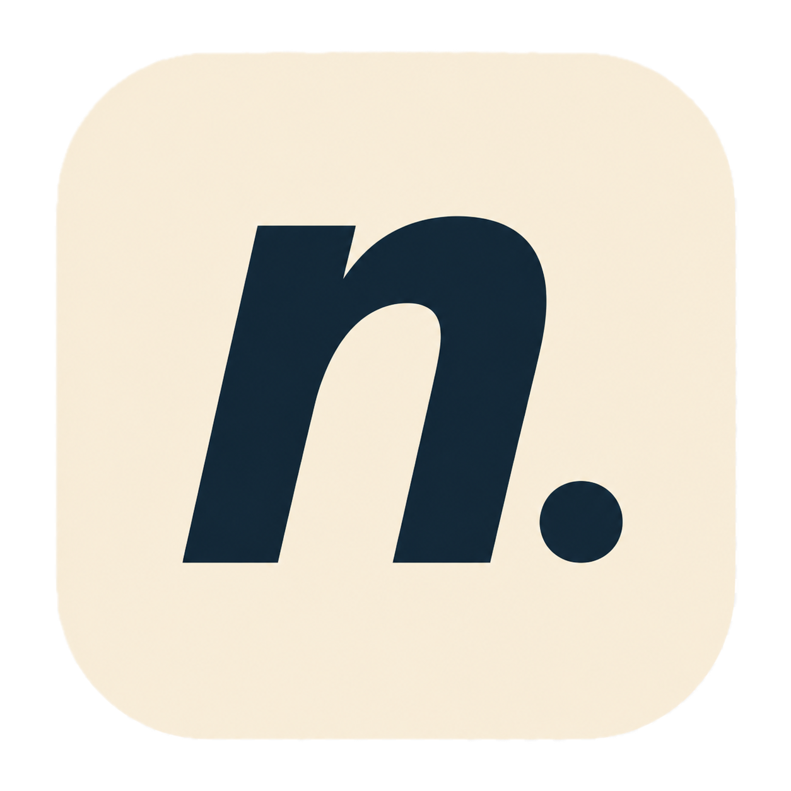

<p align="center">
  
</p>

<h1 align="center">princeagyeituffour.com</h1>

<p align="center">
  Personal portfolio for Prince Agyei Tuffour. Open source · ML · Math · Software engineering.
</p>

---

## Stack

- **Framework:** Next.js 16 (App Router, Turbopack)
- **Styling:** Tailwind CSS v4 with OKLCH color system
- **Typography:** Fraunces, Instrument Sans, JetBrains Mono
- **Animation:** GSAP 3 with ScrollTrigger, Lenis smooth scroll
- **Content:** MDX with gray-matter frontmatter, unified markdown rendering
- **Validation:** Zod v4 for content schemas

## Design

A warm, paper-and-ink palette with terracotta, moss, and ochre accents. No blue, no purple, no gradients. Typography-driven hierarchy with variable font axes (SOFT, WONK, opsz) for expressive headings. Full `prefers-reduced-motion` support.

## Running locally

```bash
pnpm install
pnpm dev
```

Open [localhost:3000](http://localhost:3000).

## Project structure

```
app/            Pages and layouts (App Router)
components/     UI components (layout, sections, primitives)
content/        MDX content (projects, writing, now)
lib/            Utilities, data fetching, site config
public/         Static assets and favicons
```

## License

All rights reserved.
