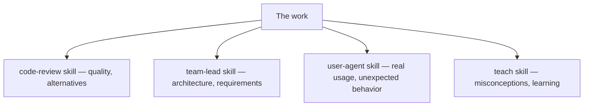
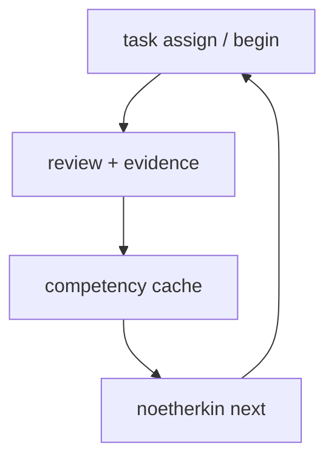

*This is Part 2 of 2. [Part 1](/writing/noetherkin-architecture-notes) covers the protocol boundary, the workspace layout, the install flow, and the state model. This part covers the skills, the catalog, a worked example, and where things honestly stand.*

## 5. The 21 skills

Every role from the earlier design survived, but each is now its own independently installable Markdown package under `skills/`, with its own contract, references, and boundary statement, and the roster grew well past the original five as real gaps showed up in practice.

| Skill | Responsibility |
| --- | --- |
| `onboarding` | Goals, environment readiness, and baseline handoff |
| `projects` | Catalog discovery and project selection |
| `task-assignment` | Bounded problem, acceptance criteria, and an investigation prompt |
| `teach` | Minimal conceptual help and teach-back, never the answer |
| `peer-engineer` | Hypotheses and discriminating experiments, thought partner, not implementer |
| `code-review` | Findings for one fixed, exact change revision |
| `team-lead` | Baseline, design, evidence, and acceptance assessment |
| `manager` | Performance patterns and next-scope recommendations |
| `codebase-map` | Learner-authored source orientation |
| `debug` | Causal investigation and discriminating experiments |
| `architecture` | Boundary and trade-off analysis |
| `design-review` | Exact-revision design checkpoint, before code is written |
| `benchmarks` | Controlled performance measurements |
| `user-agent` | Bounded simulated-user feedback, filed as a bug report, not a fix |
| `production-readiness` | Release and operability risk assessment |
| `incident-response` | Safely bounded incident exercises |
| `performance-review` | Exact-period performance synthesis |
| `promotion-review` | Adjacent-level decision proposal |
| `performance-improvement-plan` | Non-employment learning recovery plan |
| `resume-evidence` | Learner-owned, derived evidence export |
| `retrospective` | Learner-authored prediction/outcome reflection |

`user-agent`, the one I called out as the most novel piece in the original design, is unchanged in spirit: after you implement something, it behaves like an actual user, strange inputs, repeated clicks, sequences nobody planned for, and files something that reads like a real bug report rather than quietly fixing what it finds.

Skills install with one command, and installation is digest-verified so it never silently overwrites a file that doesn't match:

```sh
noetherkin skills install --global
# or, via the third-party Skills CLI:
npx skills add nanaagyei/noetherkin
```

When a skill needs a role judgment, a design assessment, a code review, a promotion recommendation, the CLI runs a separate, tool-less invocation of Codex or Claude Code to produce it. Your chat session is never the reviewer of its own work. The host is auto-detected (`--role-adapter codex|claude` to force one), both adapters share one prompt and one closed output contract, and the check runs before any consent prompt, so a missing adapter fails fast instead of after you've already confirmed something.

<figure>
  
  <figcaption>Still one shared record underneath. Now 21 contracts instead of five, and a separate, tool-less invocation does the judging.</figcaption>
</figure>

## 6. The catalog: tracks, projects, and forges

The catalog now has real numbers behind it: 34 versioned learning tracks (backend engineering, ML systems, distributed systems, GPU engineering, security engineering, and two dozen others) spanning 87 project catalog entries and 7 draft forge specifications.

<figure>
  
  <figcaption>A track organizes real projects around a progression. Forges carry the first two or three levels before a real repository's constraints take over.</figcaption>
</figure>

The distinction from the first draft's "projects" section that matters most in practice is between two different kinds of project:

- **Open-source projects** are attached, not owned. `noetherkin project select <id> --clone-to <folder>` clones a catalog entry after you confirm, pins the exact commit, and never pushes on your behalf. [Spring PetClinic](https://github.com/spring-projects/spring-petclinic), [MLflow](https://github.com/mlflow/mlflow), [KServe](https://github.com/kserve/kserve), [vLLM](https://github.com/vllm-project/vllm), [llama.cpp](https://github.com/ggml-org/llama.cpp), [Prometheus](https://github.com/prometheus/prometheus), [Argo CD](https://github.com/argoproj/argo-cd), and [etcd](https://github.com/etcd-io/etcd) are all in there today, among 87 entries.
- **Forge projects** are built from nothing. `noetherkin project select <forge-id> --source <empty-dir>` binds an empty folder; nothing is cloned. The repository owns the specification and the task pack, never a solution. Today there are seven: Eval Ledger, Accessible Data Table, SLO Burn Report, Batch Ingest, RAG Eval Harness, Agent Trace Eval, and Drift Monitor, each still marked `draft` and each carrying E0 through roughly E2 before a real upstream repository's constraints take over from E3 up.

Sixteen of the 34 tracks have a runnable path today: the seven forges, plus curated, commit-pinned task packs for Spring PetClinic, pytest, and textlint. The rest lean on the portable `task-assignment` skill against any attachable catalog project rather than a hand-curated pack. Extending the catalog is itself a supported workflow now: `noetherkin forge new <id> --track <track-id>` scaffolds a new forge specification and first task template, and `noetherkin forge check <dir>` validates an authored one against the real rules, catalog competencies, sequencing, and file conventions, reporting every problem at once.

## 7. A worked example, with real commands

This walks a task end to end using the actual CLI surface rather than a hypothetical one. Say the bound project is the Accessible Data Table forge.

**Assign and begin.**

```sh
noetherkin task assign
noetherkin task begin
```

The task carries context, acceptance criteria, and `investigation_paths`, the files the task actually lets you look at. `noetherkin task scope` lists exactly what those globs resolve to inside your project, and anything outside that scope is reported as rejected. No implementation is provided.

**Investigate and map.** `noetherkin map init` creates a project-derived template; you fill it in yourself. `noetherkin map check` verifies it against the current source revision, `absent`, `incomplete`, `unchecked`, or `checked`, and reports which paths it actually cites.

**Ask for help when it's useful.** `noetherkin task help` records a request against the task so review can weigh it later, the same `teach`, `peer-engineer`, or `team-lead` skills from Part 1, now invoked and attributed through the CLI rather than an unlogged chat aside.

**Implement, then gate.**

```sh
noetherkin task submit-design      # if the task requires a design checkpoint
noetherkin task submit-change      # snapshots your actual work
noetherkin task test --command "..."
```

A forge task snapshots every non-ignored file in your repository and runs the test command you declare yourself; the exact output, exit status, and revision are retained under `apprenticeship-artifacts/test-runs/`.

**Review, from more than one angle.**

```sh
noetherkin review code
noetherkin review task
```



**Evidence publishes automatically** once a task completes validation, tied to the task's primary and secondary competencies, in the fixture shape shown in Part 1. Separate evidence records can come out of a single task across several competencies at once, testing and codebase navigation from the same piece of work, for instance.

**Then `noetherkin next`.** It derives the current phase, runs any safe no-input step itself, and otherwise names the exact command you need to run next. Since ACP-014, it also prints a labeled `advisory` block: which competencies are tied for first attention and why, and which forges or packs exercise them. That block is explicitly derived, not evidence, and it gates nothing.



<figure>
  
  <figcaption>Same loop as the first design. Every step in it now has an exact command behind it.</figcaption>
</figure>

## 8. Safety and trust boundaries

This section didn't exist in the original piece in this explicit a form, because most of it wasn't built yet. It's now a direct commitment the CLI enforces. NoetherKin does not automatically:

- push commits or open and merge pull requests;
- deploy software or modify remote infrastructure;
- access secrets;
- delete repositories or force-reset Git;
- infer capability from self-report;
- promote a learner from task counts or model opinion.

Formal judgments require attributable evidence and role-appropriate authority. An unsupported or unenforceable write degrades to a reviewable proposal under `apprenticeship-drafts/` rather than silently failing or silently happening anyway.

## 9. Validation, honestly

```sh
npm run verify
```

That command builds the TypeScript sources, runs 106 runtime and packaging tests, checks all 21 portable skill bundles, validates the current foundation artifacts, and executes 22 frozen conformance cases. A separate, larger behavioral corpus exercises every skill against authority, stale-input, fabricated-evidence, untrusted-artifact, and draft-idempotency failure cases specifically.

None of that proves educational effectiveness, and the project's own documentation is careful to say so directly: these are bounded structural and runtime properties, not proof of learner authorship, reviewer quality, model obedience, or whether the thing actually teaches anyone anything. That's a harder, longer-running claim, and one I'd rather under-claim than over-claim here too.

## 10. What's actually shipped now

The honest table from the first draft of this piece is mostly obsolete, in the good direction: foundational specification is complete, the Spring PetClinic vertical runtime is implemented and offline-verified, all 21 skill packages are implemented, generic/Codex/Claude Code capability adapters are implemented and offline-verified, and a new learner genuinely installs from a release tarball and runs `noetherkin setup` today. What's still explicitly unfinished:

- All seven forge specifications ship as `draft`: none has been built end to end by a real learner yet, so their task wording is untested against an actual person.
- Promotion execution remains proposal-only; the CLI will assemble a promotion recommendation, but formal promotion still resolves outside automated publication.
- The full dual-harness behavioral evaluation matrix (every case, on both Codex and Claude Code, at scale) remains deferred; individual cases have been run live and confirmed, but that's smoke evidence, not a reliability measure.
- Eighteen of the 34 tracks still rely on the portable task-assignment skill against a generically attached project rather than a hand-curated pack.

## Where this leaves things

The thesis from the first draft of this piece hasn't moved: NoetherKin isn't trying to build an AI that engineers for you. It's an experiment in building an AI-supported environment where you still have to become the engineer, now with a CLI that actually enforces that boundary instead of just describing it. The state model, the skill contracts, the evidence format, the consent boundary, all of it exists in service of that one constraint.

The [repository](https://github.com/nanaagyei/noetherkin) is public under Apache 2.0, currently at v0.2.0. [Part 1](/writing/noetherkin-architecture-notes) has the protocol and workspace details; the [personal piece](/writing/what-if-learning-felt-like-joining-a-team) has the motivation.
