This is a companion piece to [a more personal post](/writing/what-if-learning-felt-like-joining-a-team) about why I started building NoetherKin. That one is about motivation. This one is about mechanics: what the system actually is, how it's structured, what's implemented versus still on paper, and where it's headed.

If you haven't read the first piece, the short version: NoetherKin is a persistent, agent-assisted engineering apprenticeship environment built around real codebases. Instead of using an AI agent primarily to generate code, it gives the learner a simulated engineering team, a manager, a team lead, a peer engineer, a teaching mentor, and a user agent, all working against shared tasks, competencies, evidence, and reviews. The learner still investigates, designs, implements, tests, and makes the actual engineering decisions. The system's job is structure, context, feedback, and a persistent record of growth over time.

This piece assumes you're comfortable with Git, repositories, coding agents, code review, and normal software development workflows. It's written for engineers and technical builders who use AI coding tools already and are interested in a specific question: how do you use these tools to become a better engineer, rather than just delegate more engineering to them.

## 1. What NoetherKin actually is

I'd avoid calling it an "AI tutor." That undersells what it's trying to do. It's closer to an apprenticeship runtime layered on top of a normal software engineering workspace.

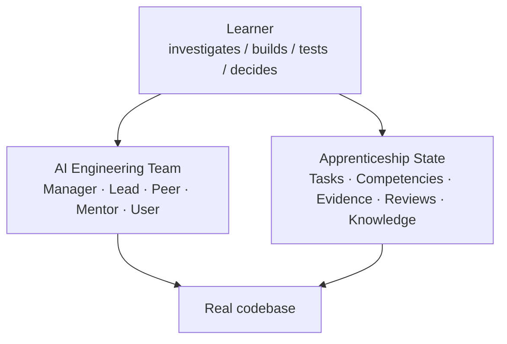

The core idea is shared, persistent state. A typical AI coding conversation looks like this:

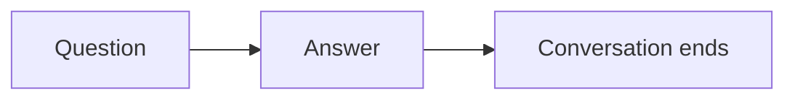

NoetherKin is designed to behave more like this instead:

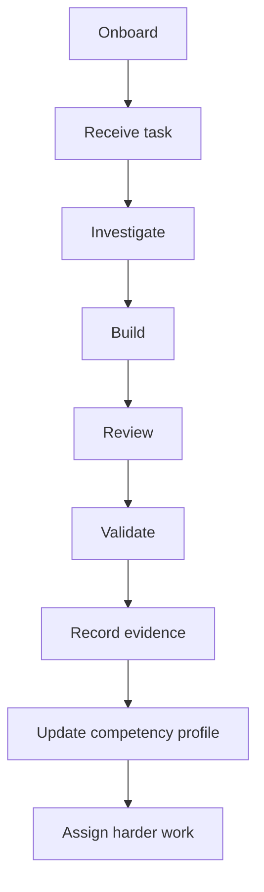

The specialized roles are meant to operate against that same underlying state rather than each being an isolated chatbot session. That's arguably the most technically interesting part of the whole design: not any individual role, but the fact that they're supposed to share a record instead of improvising their own.

## 2. Architecture

The workspace is split into two halves that don't mix:

```text
engineering-workspace/
├── AGENTS.md
│
├── .apprenticeship/
│   ├── profile.yaml
│   ├── competencies.yaml
│   ├── work/
│   ├── evidence/
│   ├── reviews/
│   └── knowledge/
│
├── source/
│   └── spring-petclinic-microservices/
│
└── README.md
```

That split isn't just "learning files vs. application files." It's NoetherKin's private apprenticeship state versus the actual upstream software repository, and that distinction matters a lot if the eventual goal is real open source contribution.

`source/` holds the actual cloned or forked project, git history and all. `.apprenticeship/` holds everything NoetherKin knows about you as a learner. That separation means you can `cd source/spring-petclinic-microservices`, run normal git commands, and push a commit or open a PR without a `.apprenticeship/` directory full of your profile, competencies, and evidence records showing up in that pull request. It's a small design decision, but it's one of the better ones in the project, because it means the thing you're learning inside doesn't have to know it's part of a learning environment at all.

<figure>
  
  <figcaption>Private apprenticeship state on one side. The real repository on the other. They do not mix.</figcaption>
</figure>

### What lives in `.apprenticeship/`

The part of this model that's stayed consistent across every iteration of the design is:

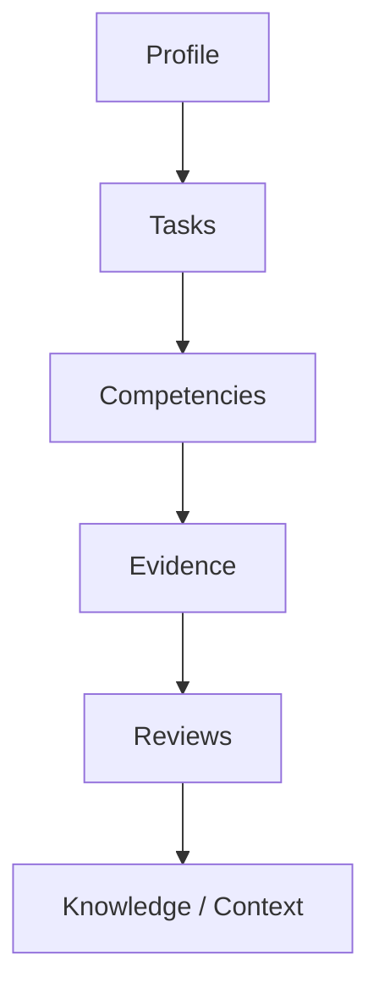

Some later sketches add folders like `goals/`, `projects/`, `context/`, `templates/`, `logs/`, and a top-level `config.yaml`. I'm not treating those as settled yet. Until they've held up across more iterations, I'd read them as exploratory rather than part of the canonical shape.

## 3. Proposed developer experience

I'm deliberately not calling this "install and quickstart," because I don't have a verified CLI command to give you yet. I'm not going to write `pip install noetherkin` or `npx noetherkin init` or `noetherkin onboard` here just because they'd look plausible in a code block. If they don't exist yet, printing them does more harm than leaving the section thin.

What the architecture implies, conceptually, is a flow that looks something like this:

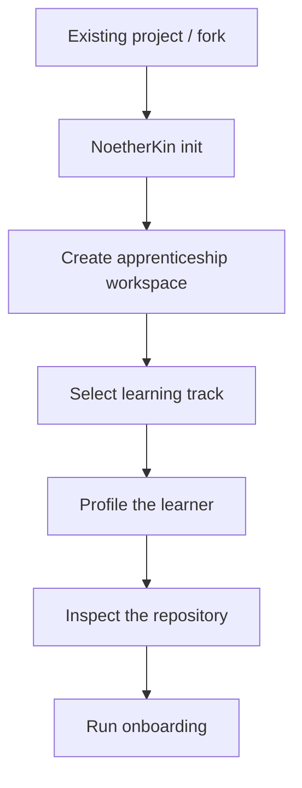

That's design intent, not a CLI contract I can point you at today. Once the actual commands exist, this section gets a lot more interesting and a lot more specific.

## 4. Configuration and state

I have one piece of this that's concrete enough to show: the evidence format. Everything else here is closer to "shape we're converging on" than "frozen schema."

### Evidence

```yaml
id: EVID-0042
competency: debugging

observation: >
  Learner independently traced a checkout
  failure across the gateway and payment service
  and identified incorrect retry behavior.

verification:
  - failing case reproduced
  - traces analyzed
  - regression test added

assistance:
  highest_level: documentation

signal:
  target_level: E2
  strength: strong
```

That structure tells you a lot about the underlying philosophy just by what fields it doesn't have. There's no `debugging_score: 87`. Instead, every record captures an observation, how it was verified, how much assistance was needed to get there, and a signal toward a competency level. That's a meaningfully different question than "how many points does this person have." It's closer to "what has this engineer actually demonstrated, and how much did they need help with."

The competency ladder these signals point toward is:

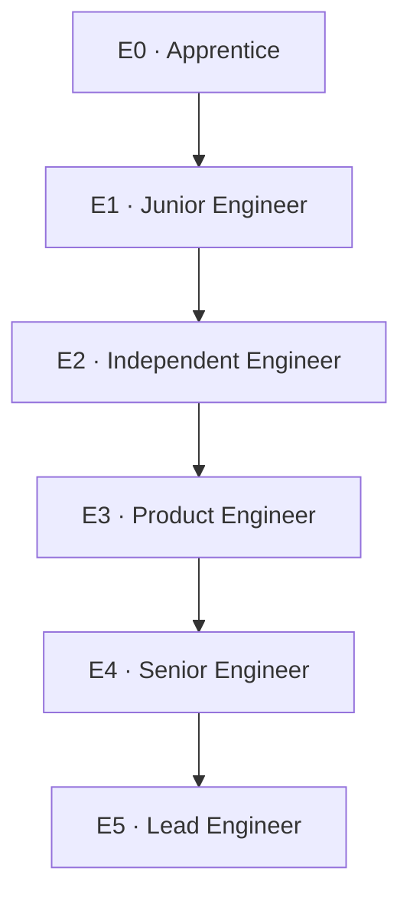

<figure>
  
  <figcaption>Progression weighs repetition, recency, variety, scope, and independence. One strong result is evidence, not proof.</figcaption>
</figure>

Progression isn't meant to be "one passed task equals one level up." It's supposed to weigh repetition, recency, how varied the contexts were, the scope of the work, and how independently it was done. A single strong debugging result is evidence, not proof.

### `profile.yaml` and `competencies.yaml`

Both of these exist as concepts inside `.apprenticeship/`, and I know roughly what they'll need to hold: learning goals, existing experience, target roles, preferred stack, current level, and learning constraints for the profile; competency definitions and current standing for the other. What I don't have yet is a schema I'd call stable enough to publish as a contract. Treat this section as "here's what these files are for," not "here's the format."

### Tasks

Here's the fuller task example, which I'm anchoring to this article specifically so it doesn't collide with task examples used elsewhere:

| | TASK-014 |
|---|---|
| Summary | Implement user registration with email verification |
| Status | In Progress |
| Area | Backend Engineering |
| Labels | authentication, backend, security |
| Difficulty | Medium |
| Estimated time | 4–6 hours |
| Repository | noetherkin-demo |
| Branch | `feature/TASK-014` |

Competencies it's meant to exercise:

- Backend Development
- Database Design
- Security Best Practices
- API Design
- Testing
- System Design

Acceptance criteria:

- [ ] user can register with a valid email/password
- [ ] verification email contains a time-limited token
- [ ] unverified users cannot log in
- [ ] verification activates the account
- [ ] invalid or expired links are handled
- [ ] tests cover the main flows

Notice what's missing: no implementation, no starter code, no "here's the function signature to fill in." That's intentional. The task defines the destination and the constraints, not the route.

<figure>
  
  <figcaption>The destination and the constraints are specified. The route is not.</figcaption>
</figure>

## 5. How the roles actually work

The current interface for the engineering-team roles looks like this:

- `/manager`
- `/team-lead`
- `/peer-engineer`
- `/teach`
- `/user-agent`

Earlier design passes also included `/onboarding`, `/task-assignment`, `/debug`, and `/code-review`, which may fold into the roles above or remain separate. Here's what each of the five core roles is meant to do.

<figure>
  
  <figcaption>Five roles, one shared record. Authority and job-to-be-done differ. The underlying state does not.</figcaption>
</figure>

**`/manager`** owns the long horizon: goals, overall progress, competency trends, and eventually performance or promotion review. It's not the role you'd ask how to write a loop.

**`/team-lead`** operates closer to the actual engineering work: task breakdown, technical direction, scope, architecture questions, and review. A team lead response looks like "your hypothesis makes sense, but before you touch the service layer, trace where validation currently enters the request path," not a pasted code fix.

**`/peer-engineer`** works alongside you rather than above you: brainstorming, weighing tradeoffs, pair debugging, and reviewing an idea before you commit to it. It's deliberately the least authoritative of the roles.

**`/teach`** switches the interaction explicitly into learning mode: explanation, Socratic questioning, filling a conceptual gap, pointing at examples or documentation. If you hit optimistic locking for the first time while working a real Spring task, `/teach` is meant to explain the concept and then hand you back to the work, rather than solving the task for you under the guise of teaching.

**`/user-agent`** is the one I think is genuinely novel here. It isn't another programming assistant. It behaves like an actual user of whatever you just built:

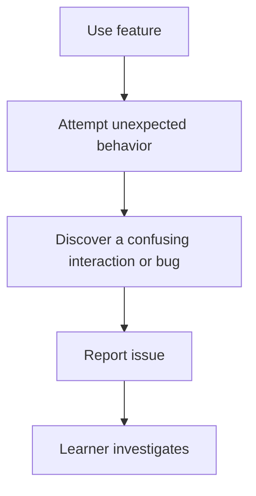

A report might read: "I created an account, clicked the verification email twice, and the second attempt returned a raw 500 error instead of telling me the link was already used." That's a much more useful failure mode to practice on than five different agents all reviewing the same diff.

### What are these, technically?

This is the part I'd flag most clearly as unsettled. The architecture describes these as reusable skills or contracts, and describes the overall system as agent-agnostic. The intended shape is roughly:

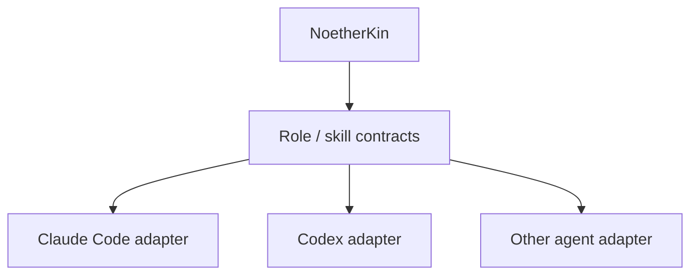

Not: NoetherKin as a Claude Code plugin. I'd stand behind that framing: the roles are reusable contracts, and individual coding-agent integrations are adapters, not the core of the system. What I wouldn't claim yet is the actual mechanism underneath: whether a given role currently ships as a Claude Code `SKILL.md` file, an MCP tool, a shell command, or something custom. The slash commands you see above describe the interaction model. They don't tell you what's running underneath it.

<figure>
  
  <figcaption>Role contracts in the middle. Agent adapters at the edge. The core should not be a plugin for one tool.</figcaption>
</figure>

## 6. A worked example

This walks through `TASK-014` end to end. I want to be upfront that this is the canonical design walkthrough, meaning it's how the system is supposed to behave, not a transcript of a completed, verified production run.

**Step 1, receive the task.** No implementation is provided, only context, acceptance criteria, relevant repository information, dependencies, the competencies being exercised, and any useful resources.

**Step 2, investigate.** The learner explores the existing code under `source/noetherkin-demo/src/`: the current account model, the login flow, the database schema, existing email infrastructure, and existing tests. Investigation itself is part of what's being observed here, not just a preamble to the "real" work.

**Step 3, ask the team when it's actually useful.** Maybe `/team-lead` to talk through an architecture decision, `/peer-engineer` to stress-test an approach, or `/teach` because token signing and expiration is unfamiliar territory. How much help was needed, and at what level, becomes part of the record later.

**Step 4, implement.** The learner designs the solution, edits the actual source repository, writes tests, and runs the application. NoetherKin isn't supposed to quietly take over at this step.

**Step 5, review.** Different roles look at the work from different angles:

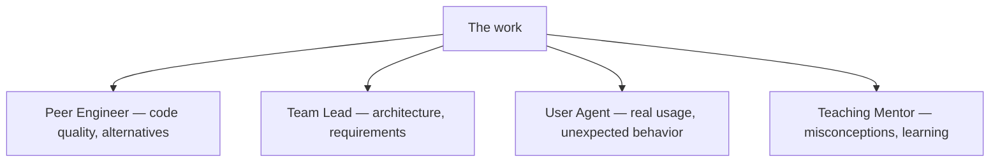

**Step 6, validate** against the acceptance criteria:

- Tests passing
- Requirements satisfied
- Review addressed
- Edge cases handled

**Step 7, generate evidence.** Not "TASK-014 complete, +500 XP." Something closer to:

```yaml
competency: backend-development

observation: >
  Designed and implemented an account-verification
  workflow across API, persistence, and email layers.

verification:
  - integration tests added
  - expired token case handled
  - duplicate verification tested

assistance:
  highest_level: conceptual-guidance

signal:
  target_level: E2
  strength: moderate
```

Separate evidence records might get generated for testing, security, and API design specifically, since a single task can produce signal across several competencies at once.

**Step 8, feed the next assignment.** That evidence becomes part of the state that decides what the learner sees next:

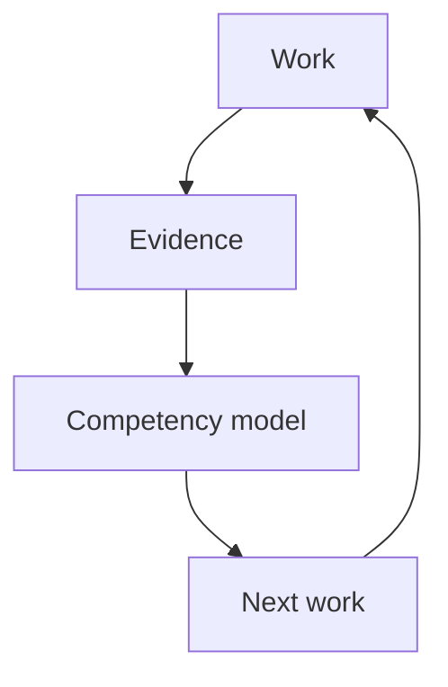

<figure>
  
  <figcaption>Work generates evidence. Evidence updates the competency model. The model shapes what comes next.</figcaption>
</figure>

That loop, work generating evidence, evidence updating the competency model, the model shaping what comes next, is the actual heart of the system. Everything else is scaffolding around it.

## 7. Extending NoetherKin

There are two axes you can extend along: tracks and projects.

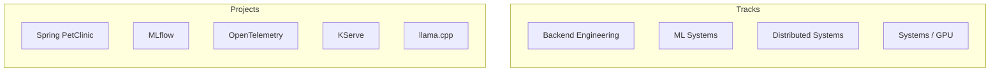

<figure>
  
  <figcaption>A track organizes projects around a progression. A project integration carries the repo, setup, competencies, and tasks.</figcaption>
</figure>

A backend-oriented path might run [Spring PetClinic](https://github.com/spring-projects/spring-petclinic) into [etcd](https://github.com/etcd-io/etcd), [RabbitMQ](https://github.com/rabbitmq), and [Prometheus](https://github.com/prometheus/prometheus). An ML-systems path might run [MLflow](https://github.com/mlflow/mlflow) into [KServe](https://github.com/kserve/kserve), [llama.cpp](https://github.com/ggml-org/llama.cpp), [Ray](https://github.com/ray-project/ray), [vLLM](https://github.com/vllm-project/vllm), and [PyTorch](https://github.com/pytorch/pytorch). A project integration will eventually need to carry things like project metadata, repository information, setup and build and test instructions, prerequisites, the competencies it exercises, difficulty, architecture context, task definitions, and validation rules, with a track organizing a set of those projects around a progression.

I don't have a verified, public catalog schema to hand you yet, so I'm not going to publish a `project: repository: ...` YAML block as if it's a real, working API. When that schema is locked, this section is where the actual format goes.

## 8. Use cases

Three, in increasing order of ambition.

**Solo engineering apprenticeship.** The clearest use case today: someone wants to get meaningfully better at backend engineering, distributed systems, ML infrastructure, systems programming, or GPU engineering, and would rather work in increasingly sophisticated real systems with structure and guidance than run through another course-toy app-forget cycle.

**Team onboarding.** A junior engineer joins a company. Instead of "read these fourteen docs and ask someone if you get stuck," they get the company's own repository, structured onboarding, guided architecture exploration, simulated tasks scoped to that codebase, mentor and team-lead roles, and an actual record of what they've demonstrated understanding of. The onboarding sequence already designed for this fits directly:

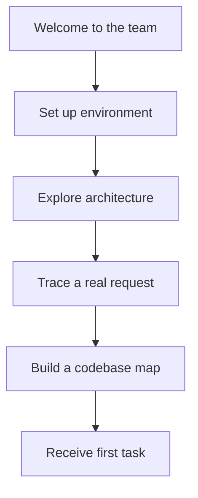

**Open source contribution funnel.** Possibly the most distinctive use case long term:

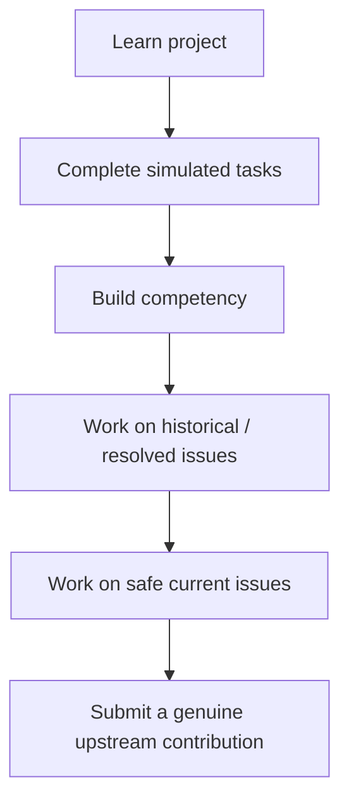

<figure>
  
  <figcaption>Learn, build, contribute, help the community, grow, then take on a harder system.</figcaption>
</figure>

Which feeds a longer loop: learn, build, contribute, help the community, grow, take on harder systems, repeat. That's the use case that would move NoetherKin from "another AI learning app" into something closer to a pipeline.

## 9. What's actually implemented versus designed

This is the part I'd rather be conservative about than impressive about. Here's where things honestly stand right now:

| Area | Status |
|---|---|
| Core product philosophy | Defined |
| Learner-centered approach | Defined |
| Engineering-team role model | Defined |
| `/manager`, `/team-lead`, `/peer-engineer`, `/teach`, `/user-agent` contracts | Defined conceptually |
| Task → investigate → build → review → validate → evidence workflow | Defined |
| Persistent apprenticeship state | Architected |
| `.apprenticeship/` separation | Architected |
| Evidence model | Defined to prototype/schema level |
| E0-E5 competency progression | Defined conceptually |
| Project/learning pathways | Designed |
| Task examples | Designed |
| UI/dashboard | Mockup stage |
| Installation CLI | Not verified |
| `profile.yaml` stable schema | Not verified |
| `competencies.yaml` stable schema | Not verified |
| Project catalog schema | Not verified |
| Automatic evidence extraction | Not verified |
| Agent-runtime implementation | Not verified |
| Claude Code / Codex adapters | Not verified |
| Fully functioning end-to-end apprenticeship | Not verified |
| Real upstream contribution workflow | Longer-term design |

None of that means these things don't exist somewhere in the private repo by the time you're reading this. It means I'm not claiming them here unless I can point at something real.

## Where this leaves things

The thesis I'd want a reader to leave with is simple: NoetherKin isn't trying to build an AI that engineers for you. It's an experiment in building an AI-supported environment where you still have to become the engineer. Everything above, the state model, the role contracts, the evidence format, the workspace split, exists in service of that one constraint.

The [repository](https://github.com/nanaagyei/noetherkin) is still private while I clean up a couple of things with GitHub Support. Once it's public, the sections above that are currently marked "not verified" are the ones I plan to come back and rewrite with exact commands, real schemas, and code someone can actually go run.
