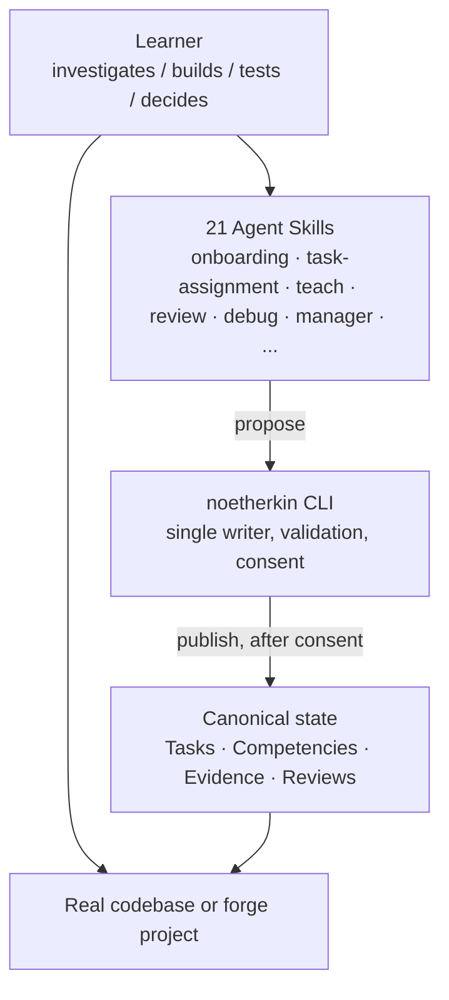
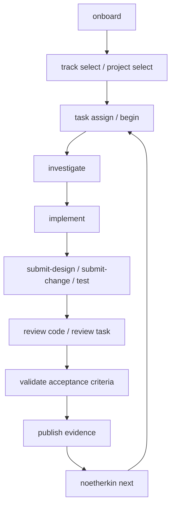
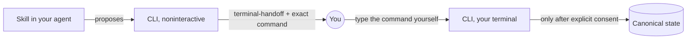
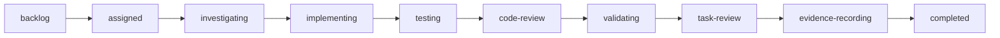
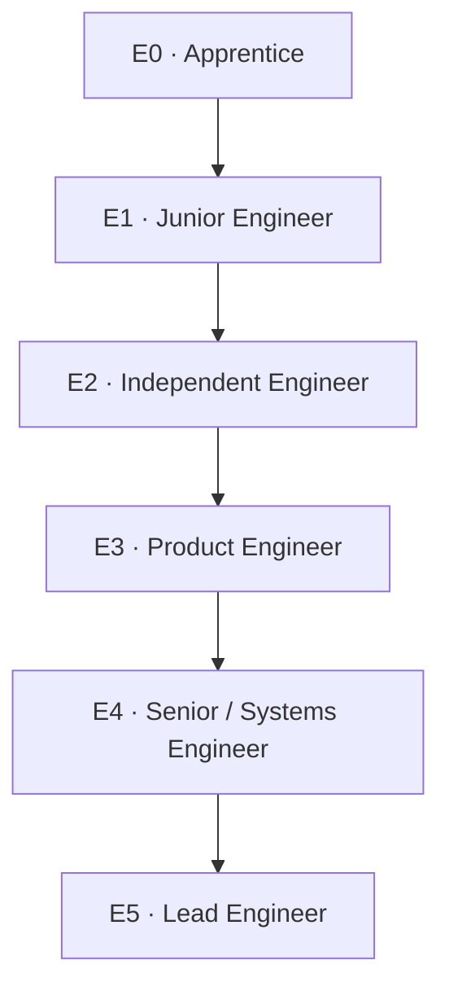

*This was one companion piece when I first wrote it. NoetherKin has since gone from a private concept sketch to a public, released CLI (v0.2.0, wire protocol 3.0, Apache 2.0), and enough of the mechanics changed underneath that one article no longer fits. This is Part 1 of 2: protocol, CLI, and workspace. [Part 2](/writing/noetherkin-architecture-notes-part-2) covers the skills catalog, the project/track/forge catalog, a worked example, and where things actually stand today.*

This is a companion piece to [a more personal post](/writing/what-if-learning-felt-like-joining-a-team) about why I started building NoetherKin. That one is about motivation. This one is about mechanics: what the system actually is, how it's structured, and how state moves through it.

If you haven't read the first piece, the short version: NoetherKin is a persistent, agent-agnostic engineering apprenticeship protocol and local CLI built around real codebases. Instead of using an AI agent primarily to generate code, it surrounds the learner with onboarding, task assignment, progressive assistance, design and code review, evidence capture, and promotion discipline, mediated by a trusted local CLI rather than a chat session. The learner still investigates, designs, implements, tests, and makes the actual engineering decisions. The system's job is structure, context, feedback, and a durable, inspectable record of growth over time.

This piece assumes you're comfortable with Git, repositories, coding agents, code review, and normal software development workflows.

## 1. What NoetherKin actually is

I'd still avoid calling it an "AI tutor." It's closer to an apprenticeship protocol with a CLI that enforces it, layered on top of a normal software engineering workspace.


```mermaid
%% Learner, skills, canonical state, and codebase
flowchart TB
  learner["Learner\ninvestigates / builds / tests / decides"]
  skills["21 Agent Skills\nonboarding · task-assignment · teach · review · debug · manager · ..."]
  cli["noetherkin CLI\nsingle writer, validation, consent"]
  state["Canonical state\nTasks · Competencies · Evidence · Reviews"]
  codebase["Real codebase or forge project"]
  learner --> skills
  skills -->|propose| cli
  cli -->|publish, after consent| state
  learner --> codebase
  state --> codebase
```

The part that changed most since the first draft of this piece isn't any individual role, it's the middle box. Skills used to be the thing I was designing. Now they're the thin, replaceable layer: they read state, mentor, and *propose* actions. A separate, trusted CLI is the only thing that ever validates and publishes a canonical record. That split turned out to matter more than almost anything else in the design, because it's what keeps a model from being able to talk itself (or the learner) into a fabricated evidence record or an unearned promotion.


```mermaid
%% The apprenticeship loop, protocol terms
flowchart TB
  onboard[onboard] --> select[track select / project select]
  select --> assign[task assign / begin]
  assign --> investigate[investigate]
  investigate --> build[implement]
  build --> gate[submit-design / submit-change / test]
  gate --> review["review code / review task"]
  review --> validate[validate acceptance criteria]
  validate --> evidence[publish evidence]
  evidence --> next[noetherkin next]
  next --> assign
```

## 2. Architecture

The repository itself is organized around the same boundary as the runtime:

```text
cli/               trusted learner-facing controller
core/              validation, lifecycle, transactions, state projection
adapters/hosts/    portable capability projections (generic, Codex, Claude Code)
adapters/runtime/  bounded model-judgment adapters
skills/            independently installable capability packages
schemas/           closed versioned state schemas
catalog/           competencies, levels, tracks, and projects
evaluations/       structural, behavioral, and adversarial checks
```

`cli/` and `core/` are the trusted boundary: deterministic code, not a model, owns schema validation, ID generation, lifecycle gates, migrations, and publication recovery. `skills/` are 21 independently installable Markdown packages that mentor and propose, never publish directly. `adapters/` project the same portable capability into whichever host you're using, `/onboarding` in Claude Code, `$onboarding` in Codex, a bare `capability:onboarding` for anything generic, without any of them getting direct write access to your record.

<figure>
  
  <figcaption>Role contracts in the middle. Host adapters at the edge. The core is not a plugin for one tool.</figcaption>
</figure>

Your own workspace, the folder you actually work in, is a different thing from the repository above. It's laid out like this:

```text
~/apprenticeship/                      your workspace: open your agent here
├── .apprenticeship/                   your record; only the CLI writes it
├── accessible-data-table/             a forge project: your own new Git repository
└── spring-petclinic-microservices/    an open-source clone, if you attach one
```

That's a meaningful change from the earlier design, which nested the real project one level down inside a `source/` folder. It doesn't anymore: every project you attach or build lives as its own sibling folder next to `.apprenticeship/`, and NoetherKin is never installed into the project itself. `cd` into `spring-petclinic-microservices/`, and it's a completely ordinary clone: normal git history, no `.apprenticeship/` directory to accidentally include in a pull request.

<figure>
  
  <figcaption>Private apprenticeship state on one side. The real repository on the other. They do not mix.</figcaption>
</figure>

There are three separate things to install, and each lives in exactly one place:

| Part | Where it lives | How often you install it |
| --- | --- | --- |
| The `noetherkin` CLI | Your global npm packages, from a GitHub release tarball | Once per machine |
| The agent skills | `~/.claude/skills` and/or `~/.agents/skills`, or one project folder with `--target` | Once per machine (or project) |
| Your workspace | A folder you choose; its `.apprenticeship/` subfolder is your record | Once per apprenticeship |

## 3. Getting started, for real this time

The last version of this piece deliberately didn't publish install commands, because I didn't have verified ones to give you. That's no longer true. NoetherKin isn't published to a package registry, on purpose: ACP-012 retired registry publication so the capabilities install straight into an agent and the CLI builds from a checkout or a release tarball instead of trusting a registry's supply chain.

```sh
npm install -g https://github.com/nanaagyei/noetherkin/releases/latest/download/noetherkin.tgz
noetherkin setup
```

`setup` reports your environment (Node, platform, Git, and whichever role host, Codex or Claude Code, it finds), then walks you through skill installation, workspace initialization, track selection, and onboarding, one confirmed step at a time. It's safe to rerun. The equivalent by hand:

```sh
mkdir my-apprenticeship && cd my-apprenticeship
noetherkin init                  # review, then type "initialize"
noetherkin tracks                # which of the 34 tracks have a runnable path today
noetherkin track select frontend-engineering
noetherkin onboard               # records an all-unassessed baseline
noetherkin next                  # prints the exact next command to run
```

The part I'd flag as the most deliberate design decision in the whole CLI: **chat text is never consent.** When a skill running inside your agent wants to do something that changes your canonical record, initializing a workspace, selecting a track, onboarding, recovering from a crash, the CLI returns a proposal instead of writing anything, with an exact command attached. The agent hands you that command. You open your own terminal, review what it's about to do, and type the literal confirmation yourself. An agent harness cannot impersonate that step, and there's no `--yes` flag that skips it.


```mermaid
%% Consent boundary
flowchart LR
  skill[Skill in your agent] -->|proposes| cli[CLI, noninteractive]
  cli -->|terminal-handoff + exact command| you((You))
  you -->|type the command yourself| cli2[CLI, your terminal]
  cli2 -->|only after explicit consent| state[(Canonical state)]
```

## 4. State and protocol

Canonical state lives under `.apprenticeship/` as plain, inspectable JSON-compatible YAML, validated against twelve closed JSON Schemas (`evidence`, `task`, `review`, `assessment`, `learner-profile`, `competency-state`, `project`, `track`, `forge`, and a few narrower ones like the current-track and current-project pointers and the derived attention advisory). "Closed" means an unsupported keyword or format is rejected at load time rather than silently ignored, and the parser itself is first-party: it's differentially tested against `ajv` over a corpus of real and mutated documents rather than trusted on faith.

Here's a trimmed version of the project's own published fixture evidence record, not a real learner's, the repository is explicit about that in the file itself, but the shape is exactly what a real one carries:

```yaml
id: EVID-map-demo
competency_id: core.codebase-navigation
fact:
  observation: >
    Learner explains a request boundary
    after a documentation pointer.
scope:
  classification: cross-component
  components: [gateway, customers-service]
assistance:
  highest_level: 1
verification:
  status: verified
  reviewer: { role: team-lead }
interpretation:
  independence: guided
  target_level: E0
  strength: moderate
```

Notice what it still doesn't have: no `score`, no points, no percentage. What changed from the earlier design is precision, not philosophy. Assistance is tracked as a numbered level (0 through 7) with who recorded it, who provided it, and when, not a loose phrase. Interpretation names an explicit target level and strength rather than leaving "how much this counts" implicit. `supersedes` and `stale_record_ids` exist so a correction doesn't quietly overwrite history; a stale judgment becomes explicitly unresolved instead.

### Tasks and their lifecycle

A task carries the same spirit as the earlier design, a destination and constraints, never a solution, but the lifecycle is now a real, enforced state machine rather than a description:


```mermaid
%% Real task lifecycle
flowchart LR
  backlog --> assigned --> investigating --> implementing --> testing
  testing --> code-review --> validating --> task-review --> evidence-recording --> completed
```

Every transition is recorded with an actor, a role, and a timestamp. A task can also record `blocked_reason`, `assistance_history` entries tied to specific competencies, and a `remediation` list, the prerequisite competencies to revisit, when a design or review comes back as rework rather than approval. None of that is new in concept from the original TASK-014 example in the first draft of this piece. What's new is that it's no longer aspirational: it's a schema the CLI actually enforces on every real task.

<figure>
  
  <figcaption>The destination and the constraints are specified. The route, and the lifecycle it moves through, is enforced by the CLI, not assumed.</figcaption>
</figure>

### The competency ladder

The six-level ladder from the original design held up unchanged:


```mermaid
%% Competency ladder
flowchart TB
  e0["E0 · Apprentice"] --> e1["E1 · Junior Engineer"]
  e1 --> e2["E2 · Independent Engineer"]
  e2 --> e3["E3 · Product Engineer"]
  e3 --> e4["E4 · Senior / Systems Engineer"]
  e4 --> e5["E5 · Lead Engineer"]
```

What's more concrete now is what each level actually means. The catalog defines thirteen behavioral dimensions per level, independence, scope, ambiguity, codebase navigation, implementation, debugging, testing, design, systems thinking, production engineering, ownership, technical communication, and collaboration, each with its own one- or two-sentence expectation at every level. "Independent Engineer" (E2), for example, isn't just a label; it's defined as someone who "plans unfamiliar work and uses limited targeted assistance," "maps unfamiliar component interactions from source," and "tests hypotheses for unfamiliar cross-component failures," among others. Advancing a level still isn't "one passed task equals one level up." It draws on longitudinal assessments and review history, repetition, recency, variety, and independence, weighed together, not a single strong result.

<figure>
  
  <figcaption>Thirteen behavioral dimensions per level now, not just a name and a vibe.</figcaption>
</figure>

## Where Part 1 leaves things

That's the protocol boundary, the workspace, the install path, and the state model. [Part 2](/writing/noetherkin-architecture-notes-part-2) covers the 21 skills themselves, the 34-track, 87-project, 7-forge catalog, a worked task from assignment through evidence using the real CLI commands, the safety boundaries the CLI enforces, and an honest accounting of what's actually shipped versus what's still marked draft.

The [repository](https://github.com/nanaagyei/noetherkin) is public, with CI and CodeQL running on every change, releases attached with checksums, and a changelog documenting every decision since the freeze.
